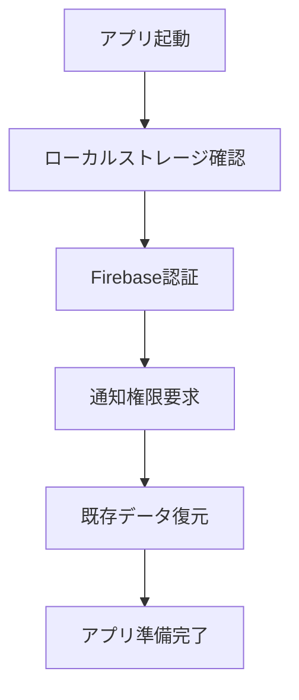
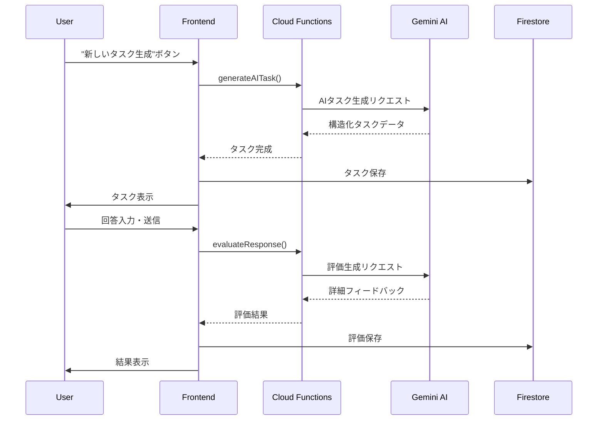
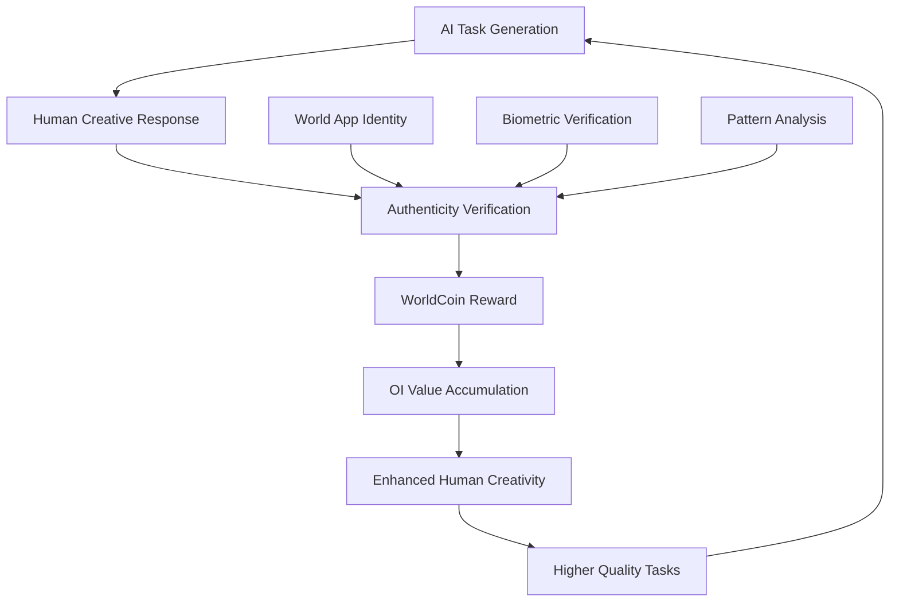

# はじめに

**「AIが人間にタスクを依頼する」** という従来とは真逆のアプローチで開発したWebアプリケーション「**Gemiyou**」について、技術的な実装から設計思想まで詳しく紹介します。

このプロジェクトは**第2回 AI Agent Hackathon with Google Cloud** での挑戦として開発しました。テーマである「AI Agent、創造の極みへ」に対して、**AIエージェントが人間にタスク依頼を行い評価し、経済価値を与える** という革新的なアプローチを考案しました。

通常のチャットボットは「人間がAIに質問・依頼する」形ですが、このアプリでは「AIが人間にクリエイティブなタスクを依頼し、人間が応答し、AIが評価する」という革新的な体験を提供しています。さらに**WorldID統合**により、AI時代における**Organic Intelligence（人間の創造性）の経済価値化**という未来的なコンセプトの設計を行いました。
またAI依存による思考力の低下の自認、およびトレーニングを兼ねています。

## 🎯 プロジェクト概要

### コンセプト
- **逆チャット体験**: AIが能動的にタスクを依頼
- **創造性重視**: 3-25分で完結する創作・アイデアタスク
- **１０のAI人格**: 専門特化した評価とフィードバック
- **簡易登録**: Googleアカウント等でインスタント認証
- **WorldCoin報酬**: 創造的タスク完了でWLD獲得
- **OI価値化**: Organic Intelligence（人間の創造性）の経済価値創出

### 主要機能
- AI人格によるタスク自動生成
- リアルタイムなAI評価とフィードバック
- **WorldCoin統合報酬システム**
- **AI生成コンテンツ検出・監視システム**
- **Worldアプリ連携による人間証明**
- プッシュ通知システム
- レスポンシブなモダンUI

### 開発成果
- **10のAI人格**: 専門特化したタスク生成・評価システム
- **レスポンシブUI**: PC/Mac/スマートフォン完全対応
- **リアルタイム評価**: Gemini AIによる即座のフィードバック
- **データ永続化**: Firestore + ローカルストレージのハイブリッド
- **認証システム**: Google/匿名認証の選択可能

### 技術スタック

以下のGoogleプロダクト活用して開発を行いました。
使った事のない技術も結構あったので勉強になりました。

**AIプロダクト:**
- **Gemini AI API**: タスク生成・評価エンジン
- **Vertex AI**: 高度なAI生成コンテンツ検出

**コンピューティングプロダクト:**
- **Cloud Functions**: サーバーレス実行環境
- **Cloud Storage**: 大容量データ保存
- **Cloud Run**: コンテナ化されたアプリケーション実行

```json
{
  "frontend": {
    "framework": "React 18 + TypeScript",
    "styling": "Modern CSS (gradients, animations)",
    "state": "React Hooks (useState, useEffect)"
  },
  "backend": {
    "platform": "Firebase (Google Cloud)",
    "database": "Firestore",
    "functions": "Cloud Functions (Google Cloud)",
    "auth": "Anonymous Authentication", 
    "hosting": "Firebase Hosting",
    "messaging": "FCM (Push Notifications)"
  },
  "ai": {
    "engine": "Google Gemini AI API",
    "features": ["動的プロンプト生成", "JSON構造化レスポンス"]
  },
  "blockchain": {
    "rewards": "WorldCoin (WLD)",
    "identity": "World ID による人間証明",
    "verification": "Biometric authentication via World App"
  },
  "monitoring": {
    "aiDetection": "AI生成コンテンツ検出システム",
    "authenticity": "多層的真正性検証",
    "oiMetrics": "Organic Intelligence定量化"
  }
}
```

## 🎭 10のAI人格システム

### 設計理念
タスクの質と評価の専門性を高めるため、以下の10の特化型AI人格を実装しました。

```typescript
// 10のAI人格定義（実際には10人格すべて実装済み）
const AI_PERSONALITIES = [
  {
    name: "アイデア発想・タケシ",
    specialty: "自由な発想とブレインストーミング",
    taskTypes: ["アイデア出し", "創造的思考", "コンセプト開発"]
  },
  {
    name: "物語創作・サクラ", 
    specialty: "魅力的なストーリーテリング",
    taskTypes: ["小説執筆", "キャラクター創造", "プロット開発"]
  },
  {
    name: "コピーライティング・レン",
    specialty: "心に響く文章とマーケティング表現",
    taskTypes: ["キャッチコピー", "商品説明", "広告文作成"]
  }
  // ... 他7つの人格（ナレッジマスター、フューチャリスト含む）
];
```

### 人格別の専門分野
| AI人格 | 専門領域 | 主なタスク |
|--------|----------|------------|
| 🎡 タケシ | アイデア発想 | ブレインストーミング、コンセプト開発 |
| 📚 サクラ | 物語創作 | 小説執筆、キャラクター創造 |
| ✍️ レン | コピーライティング | キャッチコピー、広告文作成 |
| 🎨 ミオ | デザイン思考 | UI設計、ブランディング |
| 💡 ダイ | ライフハック | 生活改善、効率化アイデア |
| 🎪 ユウ | エンタメ | ゲーム企画、イベント案 |
| 🔧 アキ | 問題解決 | 課題分析、解決案提案 |
| 🌟 ハル | 表現力 | 詩作、感情表現、芸術的創作 |
| 🧠 ナレッジマスター | 知識統合 | 学習方法、情報整理、知識体系化 |
| 🔮 フューチャリスト | 未来予測 | トレンド分析、イノベーション創出 |

## ⚡ 核心となる技術実装

### 1. Gemini AIとの統合

```typescript
// geminiService.ts
export class GeminiService {
  private genAI: GoogleGenerativeAI;
  
  constructor() {
    this.genAI = new GoogleGenerativeAI(process.env.REACT_APP_GEMINI_API_KEY!);
  }

  async generateTask(personality: string): Promise<Task> {
    const model = this.genAI.getGenerativeModel({ model: "gemini-pro" });
    
    const prompt = this.buildTaskPrompt(personality);
    const result = await model.generateContent(prompt);
    
    return this.parseTaskResponse(result.response.text());
  }

  private buildTaskPrompt(personality: string): string {
    return `
あなたは「${personality}」として、人間に創造的なタスクを依頼してください。

要求仕様:
- 実行時間: 3-25分
- 完全テキストベース
- 創造性を重視
- 具体的で明確な指示

回答形式 (JSON):
{
  "request": "具体的なタスク内容",
  "context": "背景説明",
  "expectedOutput": "期待する成果物",
  "tips": "実行のヒント",
  "difficultyLevel": {
    "name": "難易度名",
    "complexity": 1-5,
    "timeLimit": "時間目安"
  }
}
    `;
  }
}
```

### 2. Firestoreデータ構造

```typescript
// types/index.ts
export interface Task {
  id: string;
  request: string;
  context: string;
  expectedOutput: string;
  tips: string;
  difficultyLevel: {
    name: string;
    complexity: number;
    timeLimit: string;
    requiredSkills: string[];
  };
  category: string;
  aiPersonality: {
    name: string;
    type: string;
    personality: string;
  };
  evaluationFocus: string[];
  createdAt: Date;
  status: 'pending' | 'completed' | 'evaluated';
  userResponse?: string;
  evaluation?: Evaluation;
}

export interface Evaluation {
  score: number;
  feedback: string;
  strengths: string[];
  improvements: string[];
  nextSteps: string[];
  evaluatedAt: Date;
}
```

### 3. リアルタイム評価システム

```typescript
// 評価実行の流れ
const evaluateUserResponse = async (task: Task, response: string) => {
  setEvaluating(true);
  
  try {
    // 1. Gemini AIで評価生成
    const evaluation = await geminiService.evaluateResponse(task, response);
    
    // 2. Firestoreに保存
    await firestoreService.saveEvaluation(task.id, evaluation);
    
    // 3. ローカル状態更新
    setTasks(prev => prev.map(t => 
      t.id === task.id 
        ? { ...t, userResponse: response, evaluation, status: 'evaluated' }
        : t
    ));
    
    // 4. 統計更新
    updateUserStats(evaluation.score);
    
  } catch (error) {
    console.error('評価エラー:', error);
  } finally {
    setEvaluating(false);
  }
};
```

## 🔄 アプリケーションフロー

### 1. 初期化プロセス


### 2. タスク生成から評価まで


## 🎨 UI/UXの工夫

### レスポンシブデザイン
```css
/* モダンなグラデーション */
.app-container {
  background: linear-gradient(135deg, 
    #667eea 0%, 
    #764ba2 50%, 
    #6B73FF 100%);
  min-height: 100vh;
}

/* スムーズなアニメーション */
.task-card {
  transform: translateY(20px);
  opacity: 0;
  animation: slideUpFade 0.6s ease-out forwards;
}

@keyframes slideUpFade {
  to {
    transform: translateY(0);
    opacity: 1;
  }
}
```

## 📱 プッシュ通知システム

### FCM実装
```typescript
// notificationService.ts
export class NotificationService {
  async requestPermission(): Promise<string | null> {
    const permission = await Notification.requestPermission();
    
    if (permission === 'granted') {
      const messaging = getMessaging();
      const token = await getToken(messaging, {
        vapidKey: process.env.REACT_APP_FIREBASE_VAPID_KEY
      });
      return token;
    }
    return null;
  }

  async scheduleTaskNotification(delay: number = 3600000) { // 1時間後
    setTimeout(async () => {
      if ('serviceWorker' in navigator && 'Notification' in window) {
        const registration = await navigator.serviceWorker.ready;
        registration.showNotification('新しいAIタスクが準備されました！', {
          body: 'クリエイティブな新しい挑戦が待っています',
          icon: '/logo192.png',
          badge: '/logo192.png',
          tag: 'gemiyou-task'
        });
      }
    }, delay);
  }
}
```

プッシュ通知は実装済みですが、ブラウザ環境やモバイル端末（特にSafariのFCM非対応）により動作が制限される場合があります。今後はFlutter等でのネイティブアプリ化も検討しています。

## 🔧 Cloud Functions

### サーバーレス関数の実装
```javascript
// functions/index.js
const { onCall } = require('firebase-functions/v2/https');
const { GoogleGenerativeAI } = require('@google/generative-ai');

exports.generateAITask = onCall(async (request) => {
  const { aiPersonality, difficulty = 'standard' } = request.data;
  
  try {
    const genAI = new GoogleGenerativeAI(process.env.GEMINI_API_KEY);
    const model = genAI.getGenerativeModel({ model: "gemini-pro" });
    
    const prompt = buildTaskGenerationPrompt(aiPersonality, difficulty);
    const result = await model.generateContent(prompt);
    
    return {
      success: true,
      task: parseTaskFromResponse(result.response.text()),
      metadata: {
        generatedAt: new Date().toISOString(),
        aiPersonality,
        difficulty
      }
    };
  } catch (error) {
    console.error('タスク生成エラー:', error);
    return {
      success: false,
      error: {
        code: 'GENERATION_FAILED',
        message: 'タスク生成に失敗しました'
      }
    };
  }
});
```

## 📊 パフォーマンス最適化

### ローカルストレージ戦略
```typescript
// データ永続化とパフォーマンス向上
const saveToLocalStorage = (key: string, data: any) => {
  try {
    localStorage.setItem(`gemiyou-${key}`, JSON.stringify(data));
  } catch (error) {
    console.warn('ローカルストレージ保存失敗:', error);
  }
};

const loadFromLocalStorage = (key: string) => {
  try {
    const data = localStorage.getItem(`gemiyou-${key}`);
    return data ? JSON.parse(data) : null;
  } catch (error) {
    console.warn('ローカルストレージ読み込み失敗:', error);
    return null;
  }
};
```

### メモ化とキャッシュ
```typescript
const memoizedPersonalities = useMemo(() => 
  AI_PERSONALITIES.map(p => ({
    ...p,
    color: getPersonalityColor(p.type)
  })), []
);

const cachedTasks = useCallback((tasks: Task[]) => 
  tasks.filter(task => task.status === 'completed'), [tasks]
);
```

## 🚀 デプロイメント

### Firebase Hosting
```bash
# ビルド・デプロイ手順
npm run build
firebase deploy

# 環境変数設定
firebase functions:config:set gemini.api_key="YOUR_API_KEY"
```

### CI/CDパイプライン
```json
{
  "scripts": {
    "predeploy": "npm run build",
    "deploy": "firebase deploy",
    "deploy:functions": "firebase deploy --only functions",
    "deploy:hosting": "firebase deploy --only hosting"
  }
}
```

## 🎓 開発を通じた技術的学び

### 新たに習得した技術
- **Gemini AI API**: プロンプトエンジニアリングとJSON構造化
- **Cloud Functions**: サーバーレス関数の設計・デプロイ
- **Firestore**: NoSQLデータベース設計とリアルタイム同期
- **FCM**: プッシュ通知システムの実装

### 設計上の挑戦
- **AI人格の差別化**: 10の異なる専門性を持つプロンプト設計
- **評価システムの公平性**: 主観的創造性の客観的評価手法
- **UX最適化**: 「逆チャット」という新しいインタラクション設計

## 革新的な報酬システム：WorldCoin統合

### WorldCoin統合の現状と展望
現在はコンセプト設計・プロトタイプ段階ですが、以下の実装を計画中：

**Phase 1 (設計済み):**
- OI価値評価アルゴリズム
- 真正性検証システム設計
- 報酬計算ロジック

**Phase 2 (実装予定):**
- World ID統合
- WorldCoin報酬配布
- Worldアプリ連携

### Organic Intelligence（OI）の価値創出
AI時代における人間の創造性に経済的価値を与える仕組みを設計中です。

```typescript
// WorldCoin統合の概念実装
interface TaskReward {
  taskId: string;
  difficulty: number;
  creativity: number;
  baseReward: number; // WorldCoin基本報酬
  qualityBonus: number; // 品質ボーナス
  uniquenessMultiplier: number; // 独創性倍率
}

const calculateReward = (task: Task, evaluation: Evaluation): TaskReward => {
  const baseReward = task.difficultyLevel.complexity * 0.1; // WLD
  const qualityBonus = (evaluation.score / 100) * 0.05;
  const uniquenessMultiplier = evaluation.creativity > 80 ? 1.5 : 1.0;
  
  return {
    taskId: task.id,
    difficulty: task.difficultyLevel.complexity,
    creativity: evaluation.creativity,
    baseReward,
    qualityBonus,
    uniquenessMultiplier,
    totalReward: (baseReward + qualityBonus) * uniquenessMultiplier
  };
};
```

### AIvs人間監視システムの実装
```typescript
// AI生成コンテンツ検出システム
interface AuthenticityCheck {
  humanVerificationScore: number; // Worldアプリ内人間証明
  writingPatternAnalysis: number; // 文体パターン分析
  creativityMetrics: number; // 創造性指標
  timeSpentOnTask: number; // タスク実行時間
  biometricData?: BiometricSignature; // 生体認証データ
}

const verifyHumanCreativity = async (
  response: string, 
  worldId: string
): Promise<AuthenticityCheck> => {
  // 1. Worldアプリでの人間証明確認
  const humanVerification = await worldAPI.verifyHuman(worldId);
  
  // 2. 文体パターン分析（AI生成検出）
  const writingAnalysis = await analyzeWritingPattern(response);
  
  // 3. タスク実行時間の妥当性チェック
  const timeAnalysis = validateTaskExecutionTime(startTime, endTime);
  
  return {
    humanVerificationScore: humanVerification.confidence,
    writingPatternAnalysis: writingAnalysis.humanLikelihood,
    creativityMetrics: writingAnalysis.originalityScore,
    timeSpentOnTask: timeAnalysis.duration,
    overallAuthenticity: calculateOverallScore(...)
  };
};
```

## 🌐 Organic Intelligence経済圏の構想

### AIとOIの共生エコシステム


### 報酬モデルの設計思想
**人間の創造性に経済価値を与える理由:**

1. **AI時代の人間価値**: 自律AIが普及する世界で、人間の直感・感情・創造性が希少価値となる
2. **品質向上のインセンティブ**: 報酬により人間のタスク品質とモチベーションが向上
3. **真の創造性の証明**: WorldCoinの人間証明により、AI生成でない真のOI成果を担保

```typescript
// 未来的な価値評価システム
interface OIValueMetrics {
  empathy: number;        // 共感性スコア
  intuition: number;      // 直感性スコア  
  cultural: number;       // 文化的理解度
  emotional: number;      // 感情的知性
  serendipity: number;    // 偶発的発見力
}

const evaluateOrganicIntelligence = (response: string): OIValueMetrics => {
  // AI では模倣困難な人間固有の知性を定量化
  return {
    empathy: analyzeEmpathyLevel(response),
    intuition: detectIntuitiveLeaps(response),
    cultural: assessCulturalNuance(response),
    emotional: measureEmotionalDepth(response),
    serendipity: findUnexpectedConnections(response)
  };
};
```

## まとめ

「Gemiyou」は従来のChatAIインタラクションを逆転させることで、新しいクリエイティブ体験を創出しました。そして**World ID統合による報酬システム**により、AI時代における**Organic Intelligence（OI）の経済価値**を具現化する世界初のプラットフォームを目指しています。

また如何に人間は創造的タスク・思考タスクを苦手としているか。
またAIを利用するようになり、どれだけ自分の思考力が落ちたのか。
AIに依頼されるタスクを通して自分を見つめ直す事を目的として開発しました。

AI同様人間には報酬モデルが必要でWeb3ベースのWorld Coinを配布する事でタスクをこなす人が将来的に出てくるのではないかと考えており、Worldのミニアプリとして展開を検討しています。
多方面で協力してくれる方いましたら是非お声がけください。

作りながらも「何の役に立つんだ？」と自問する日々もありましたが、**誰もやったことがない発想・プロダクトほど楽しいものはありません**。前例のないコンセプトを形にできたことは、開発者として非常に有意義な体験でした。

素晴らしい機会を提供いただいた**Zenn・Google Cloud**、そして**第2回 AI Agent Hackathon**の運営の皆様に心より感謝いたします。

**技術的なポイント:**
- Firebase + React + TypeScriptの現代的なスタック
- Gemini AIの効果的な活用
- UX重視の設計思想
- サーバーレスアーキテクチャ

**革新的なアスペクト:**
- AI主導のタスク生成
- 人格特化型の専門評価
- 即座に始められる体験設計
- **WorldCoin連携による創造性の経済化**
- **AI vs 人間の真正性検証システム**

**未来への展望:**
- **OI（Organic Intelligence）経済圏**の創出
- **創造性労働**の新しい価値基準
- **AI-Human共生社会**の実現

この逆転発想と報酬システムが、今後のAI-Humanコラボレーションにおける**人間の創造性の経済価値**を確立し、自律AI時代での新しい労働形態と社会システムの可能性を示していると考えています。

---

🔗 **プロジェクトリンク**
- [Live Demo](https://gemiyou.web.app) - 実際にお試しいただけます
- [GitHub Repository](検討中) - オープンソース化予定
- [技術ドキュメント](検討中) - API仕様書準備中
